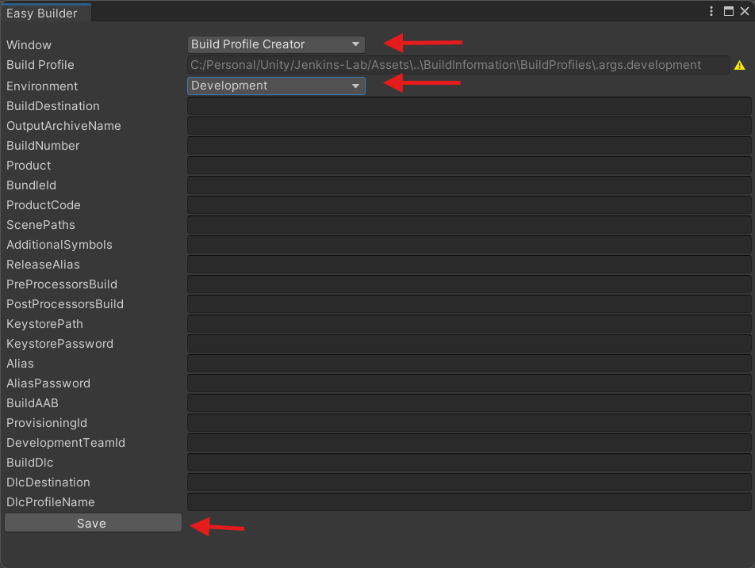

# Easy Builder

Easy Builder provides a one-click build system that lets you generate builds for multiple target platforms and environments such as Debug, Development, Staging, Release, and Distribution.
Designed for productivity, it fully supports Unity batch mode and integrates seamlessly with CI/CD pipelines such as Jenkins (via a dedicated GitHub repository ).
It also includes flexible pre- and post-build processing using ScriptableObject profiles, allowing teams to create reusable build pipelines tailored to each environment with no repeated configuration.

## Key Features

- One-click build generation
- Configure once, reuse forever
- Environment-based build settings
- Supports 5 environments: Debug, Development, Staging, Release, Distribution
- ScriptableObject-based pre/post build processors
- Batch mode build support, CI/CD ready
- DLC build support (Addressables only for now)
- Works with [Unity-Jenkins-Pipeline](https://github.com/Bon-Games/Unity-Jenkins-Pipeline.git)

## Usage Guideline
### Start a Build

- In Unity, go to Toolbar → BonGames → Easy Builder Editor
- Select the desired Build Target and Environment
- Click the `Build` button

### Create a Build Profile

- In Unity, go to Toolbar → BonGames → Easy Builder Editor
- Open the `Build Profile Creator` window
- Choose the Environment you want to configure
- Enter your build information (version, output path, keystore, etc.)
- Click `Save` to create the profile

### Build DLC (Addressables)

- Make sure the Addressables package is installed.
- Add the following to your Scripting Define Symbols: `UNITY_ADDRESSABLE`

- In Unity, go to Toolbar → BonGames → Easy Builder Editor
- Open the `Dlc Builder` window
- Choose Dlc profile, Environment and Build Target.
- Press the `Build` button
