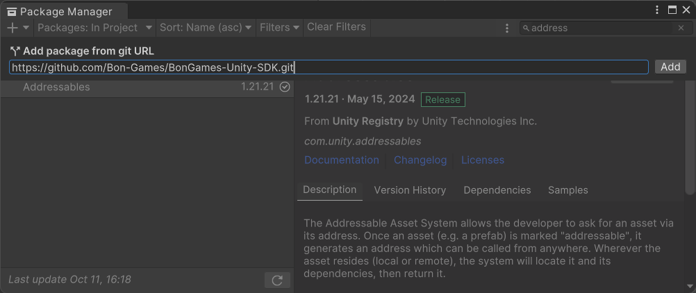
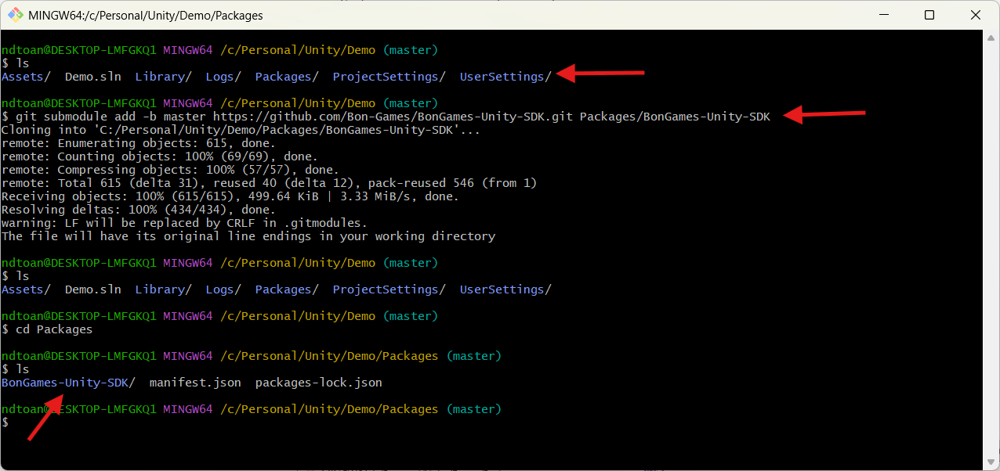

# Introduction - Bon Games SDK
Bon Games SDK is a modular development toolkit for Unity designed to improve productivity, streamline workflows, and support scalable game development. It provides a collection of tools, utilities, and development standards that help teams build, manage, and maintain projects more efficiently.

# Features
- [Easy Builder](./EasyBuilder/README.md)

## Installation
### Option 1: Install via Unity Package Manager
- In Unity, open Window > Package Manager
- Click Add package from Git URL ...
- Paste the following URL: https://github.com/Bon-Games/Build-Tools.git

### Option 2: Install as a Git Submodule
- Make sure your Unity project is already using Git
- Open a terminal at the root directory of your Unity project
- Run the following command:
- `git submodule add -b master https://github.com/Bon-Games/Build-Tools.git Packages/BonGames-Unity-SDK`

